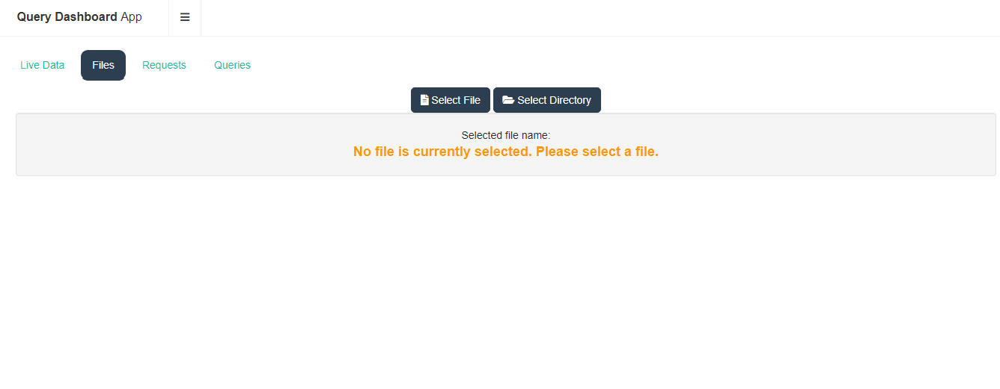
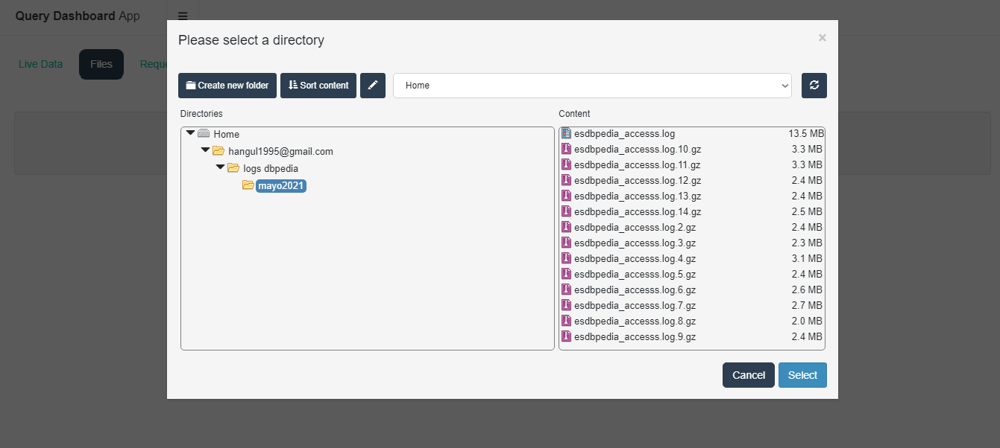
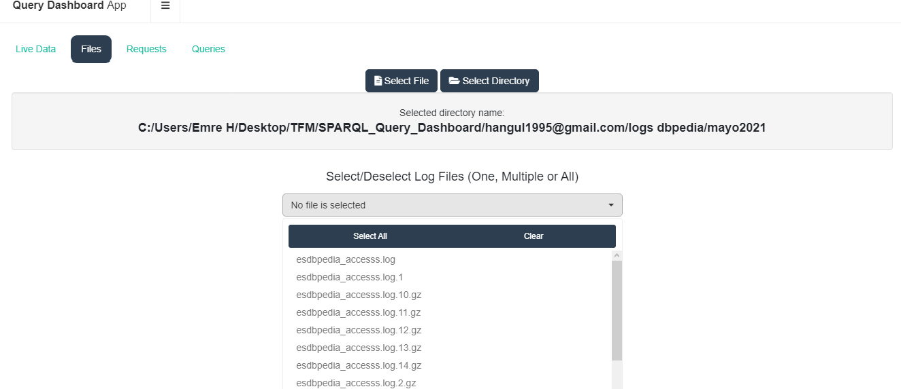
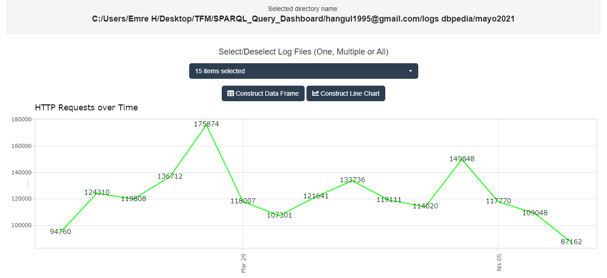
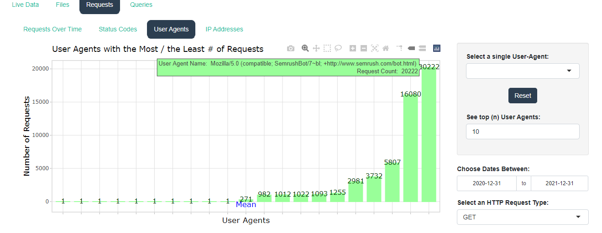
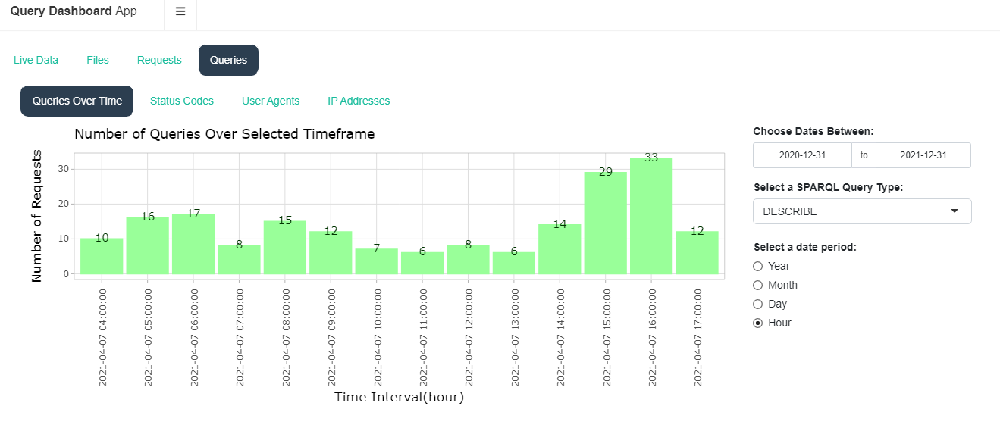
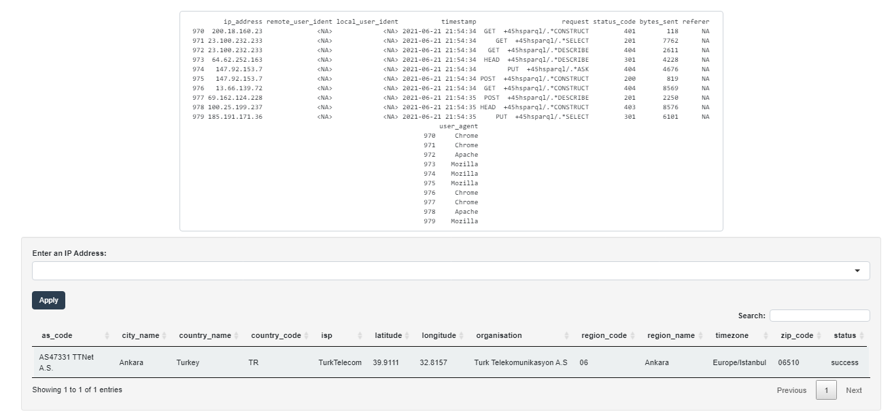

# SPARQL_Query_Dashboard

This project is created for the purpose of the defense of the Master's Thesis of Emre Hangul in the Universidad Politécnica de Madrid in July 2021. 

The project has the implementation of a SPARQL Query Dashboard Application, by which the users of the application are able to read files from the local system of their computers and produce several statistics and graphics about them. The files are the log files in the Combined Log Format (CLF) created by the Apache httpd servers. 

The point of difference of this application compared to the other usual log analysis software tools is that it provides the generation of statistics and graphs according to different SPARQL Query types. Additionally to the common graphs used in log analysis tools such as seeing the type of HTTP requests over time or seeing the IP addresses that generate those requests, the users can also differentiate the HTTP Requests with the 4 different types of SPARQL Queries, namely "SELECT, "CONSTRUCT", "DESRCRIBE" and "ASK" queries. For more information on SPARQL and the types of SPARQL queries, please see https://www.w3.org/TR/rdf-sparql-query/. 

The main files of the application are "app.R" and "app.conf" files. The users could put these 2 files in a directory and run the "app.R" file either by a command line or by RStudio. The instructions necessary to run the application is also given in the "app.conf" file. Please read this configuration file before running the app. The users are required to define 2 different information: the "path" of the live (simultaneously updated) log file and the "name" of the live log file. The comments written in the app.conf should guide the user to properly define these 2 information. If the user does not have a live log file, the application is still usable to produce graphs and statistics from the log files stored in the user's local file system.

This application is functional both in Windows and Linux operating systems and it should work in macOS without errors as well.

For a more sophisticated approach, the users can create a Docker Hub image by using the folder named "Docker" in this repository. The users could download this "Docker" folder and place them in a directory in their local computer, change the working directory to that directory, then via a command line, they can create a Docker image of their own by using the "DockerFile" in the "Docker" folder. The necessary codes to build and run a Docker image is given at the end of the "DockerFile". For more information on how to create a Docker image from an RShiny application, please see https://www.statworx.com/ch/blog/how-to-dockerize-shinyapps/.  

In any case of needing further information related to the application, please contact with the owner of the app github.com/EmreHangul.

Screenshots from the application:

